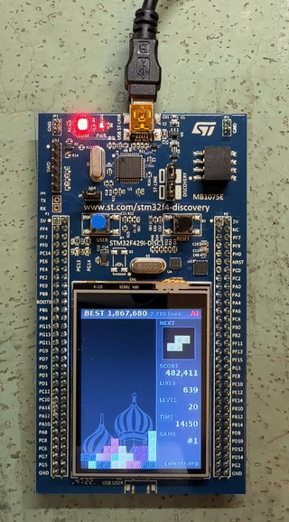

# Tetromino desktop ornament (STM32F429I-DISC1)



AI port (Claude Code) of my browser JavaScript Tetromino
(<https://zwiener.org/tetromino.html>, 2011-2016) to the STM32F429I-DISC1 with
its 240x320 panel. The AI just plays forever.  The best score and the number of
games are kept in flash.

```
game/        game core + AI, renderer
stm32f429/   firmware: HAL, BSP, display and glue code
sim/         host PC simulator
tests/       test suite
tools/       gen_assets.py (artwork from art/ -> game/assets.c)
web/         the game and AI as one standalone web page
art/         tile sheet and background (input of gen_assets.py)
```

## Flash a prebuilt release

Just download `firmware.bin` from the
[releases page](https://github.com/jnz/stm32_tetromino/releases), connect
the board through its ST-LINK USB port and copy the file onto the drive
that shows up (`DIS_F429ZI`). The board restarts with the game.

Alternatively flash `firmware.hex` with STM32CubeProgrammer.

## Build and flash

Everything from the repository root:

```
make flash           # build the firmware and flash via ST-LINK
make firmware        # build only (stm32f429/firmware.elf)
make test            # host tests: game rules, AI, flash store, renderer
```

The firmware needs the arm-none-eabi toolchain: put its path into
`stm32f429/config.mk`, e.g. `TOOLCHAIN_ROOT=C:/ST/STM32CubeCLT_1.21.0/GNU-tools-for-STM32/bin/`.
The host targets need any C11 gcc.

Options for the firmware go on the same command line:

```
make flash ROTATE=1       # picture turned by 180 degrees (USB cable at the bottom)
make flash DEBUG=1        # probe can attach while running
```

## Behaviour

- Field 10x22 (2 hidden spawn rows), 7-bag randomizer,
  wall kick tables, scoring (40/100/300/1200 x level), level every 10 lines up
  to 20, ghost piece, and the AI moving the piece one key press per 50 ms tick.
- **AI.** Search over the falling and the preview piece, rated by
  Dellacherie's features with weights tuned from El-Tetris.
  The ten best pairs also get a third ply: the mean over the pieces still left
  in the 7-bag. That part runs four candidates per tick while the piece
  moves, so every tick stays within its 50 ms at 90 MHz. While the stack
  is low it keeps the right column free as a well and plays for tetromino
  clears, above that for survival. Placements it cannot reach in time
  at the current speed are skipped.
- **High score in flash.** A save happens at every game over and every 20 min
  while a game is ahead of the record. An erase happens once per 256 saves.
  Scores are 64 bit: the AI passes 2^32 points within weeks. Numbers too
  wide for their place on screen are shortened to three digits and k, M,
  G, T, P or E.
- **256 colours, no SDRAM.** Double buffering, both buffers fit into the
  internal SRAM and everything else (variables, stack) is in CCM.
  The SDRAM is not initialised and powered-down.
- **Partial redraw.** Only redraw changed screen elements.
- **Line clear effects.** Clearing two or more lines changes the palette
  for a moment, more the more lines: a warm light-up for two (text turns
  dark), the same in blue for three, a turn round the colour wheel for a
  tetromino clear. Only the LTDC's CLUT changes, the framebuffer is left
  alone.
- **Against image retention.** The picture wanders by up to 2 px, one pixel
  every 2 min, by moving the LTDC layer window. Static edges (labels,
  separator) spread over a few pixels instead of sitting on the same ones
  for months.
- **Watchdog.** Independent watchdog (~4 s) active.
- **User button** (B1, blue). Short press: fast drop on or off, the AI
  drops each piece as soon as it is in place.
  Long press (1 s): screen turned by 180 degrees, or back.

## In the browser

`web/tetromino.html` is the same game and AI as a single standalone page,
ported from the C code (with the same seed it plays the same game as the
board). Open it in any browser: `F` fullscreen, `I` fast drop, `S` sound
effects and `M` music (those of the original browser version), `P` pause.
The arrow keys, `Z`, `X` and Space take over from the AI, which plays
again after your game over. `Ctrl+Z` takes back the last piece. `?blunder=50` makes the AI drop a piece
at random now and then.

## Regenerating the artwork

`python tools/gen_assets.py` (Pillow, DejaVu Sans Bold from matplotlib or the
system). Tiles come from `art/tetromino_blocks.png` scaled to
15 px, the background from `art/basi.png`.

